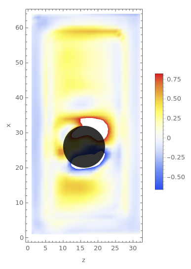
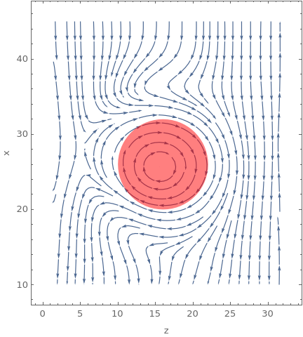
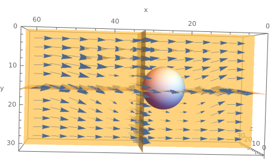

# Unsupervised Learning for Incompressible 3D Fluid
3D Fluid model capable of simluating incompressible fluid flow. The architecture of the
Nueral Network is a 3D U-net, and is trained on a loss function based on Naiver-Stokes equations for
incompressible fluids.

# Examples
For all the following examples, the initial velocity field was all zero (stationary fluid) inside the boundary and fluid flowing in the -x direction at the boundaries. The model will predict how the velocity/pressures field will change in later time steps, keeping with the Naiver-Stokes equations as closely as possible.

Pressure field and velocity field around a spinning Cylinder clockwise.

3D visualization of the velocity field around a static sphere.

# References
The model is based on the following two papers:
1. [Learning Incompressible Fluid Dynamics from Scratch](https://arxiv.org/pdf/2006.08762.pdf)
2. [Fast Fluid Simulations in 3D](https://arxiv.org/pdf/2012.11893v1.pdf)
